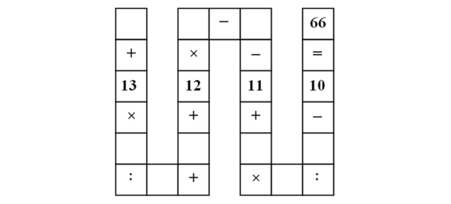

# Vietnamese puzzle

Can you fill 1..9 numbers in squares?

See also:
http://abc7.com/education/can-you-solve-this-third-grade-math-problem/732268/
https://gizmodo.com/there-are-other-possible-solutions-but-the-first-one-i-1705742922

This is a simple equation. It's not specified if the numbers must be distinct, however, I tried distinct ones, and there are 2672 unique solutions.

The problem is easy enough to be solved my [toy-level MK85 SMT solver](https://github.com/DennisYurichev/MK85).

